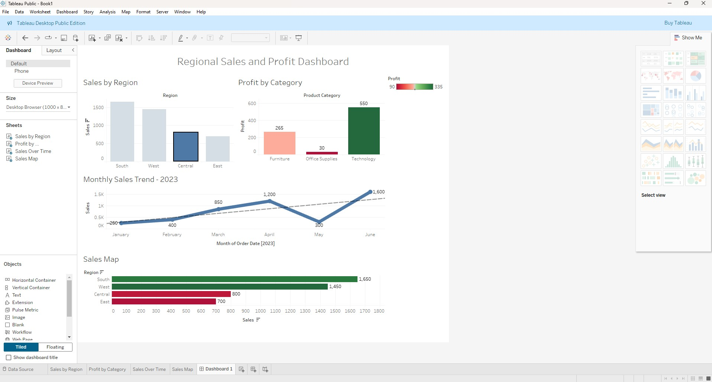
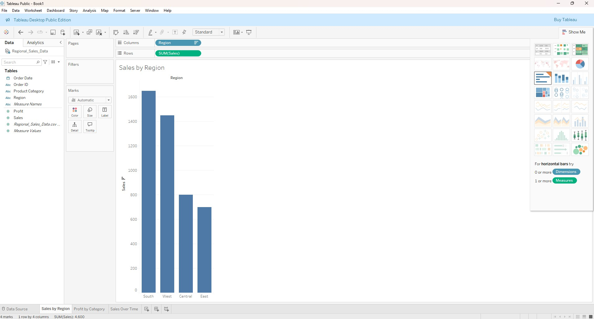
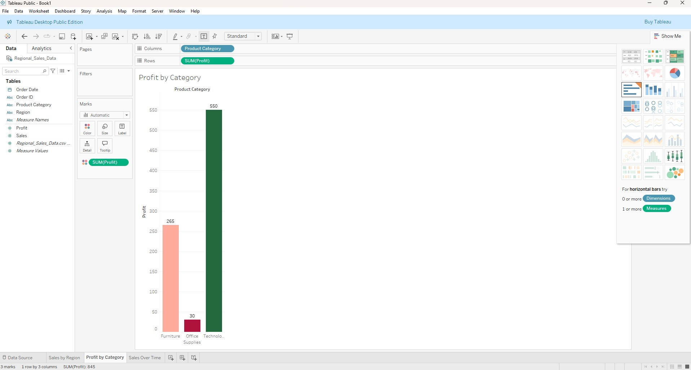
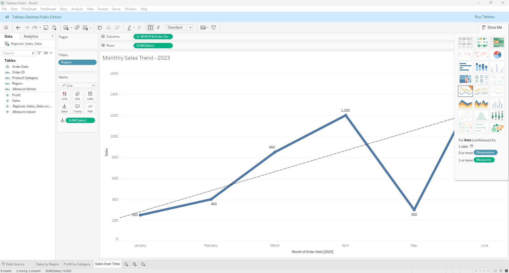
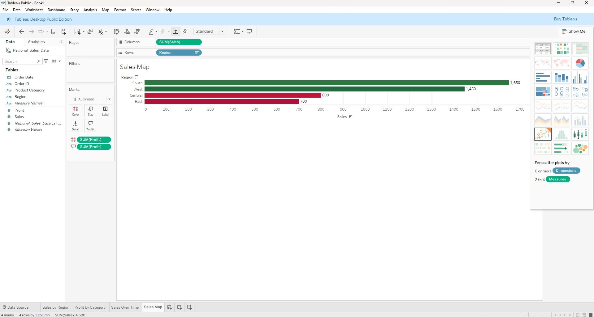

# 📊 Regional Sales and Profit Dashboard (Tableau Project)

---

## 🛠️ Skills Practiced
- Data Connection and Preparation in Tableau
- Building Bar Charts, Line Charts, and Comparative Visuals
- Using Color and Size to Represent Metrics
- Creating Interactive Dashboards with Filters
- Designing a Clear, Professional Data Story

---

## 📚 Project Overview
This project focused on analyzing regional sales performance and profitability using Tableau.  
The dataset included sales orders from various regions across multiple product categories.  
The goal was to create a clean, professional dashboard highlighting key metrics.

The dashboard provides:
- Sales by Region (Bar Chart)
- Profit by Product Category (Bar Chart)
- Sales Trend Over Time (Line Chart)
- Sales and Profit Comparison by Region (Horizontal Bar Chart)

Users can filter data interactively by region and product category.

---

## 📂 Files Included
- `Regional_Sales_Data.csv` — Raw sales dataset
- `Regional_Sales_Profit_Dashboard.twb` — Packaged Tableau Workbook containing the dashboard
- `/Tableau_Screenshots/` — Screenshots of individual visualizations and the full dashboard

---

## 📸 Screenshots

### Full Dashboard Overview

### Individual Visuals
- **Sales by Region** 
- **Profit by Product Category** 
- **Sales Over Time** 
- **Sales & Profit by Region** 

---

## 🚀 Key Insights
- The West region achieved the highest total sales and profitability.
- Technology was the most profitable product category.
- Sales showed a steady upward trend over the first six months.
- Regional differences in profitability provide opportunities for targeted strategies.

---

## 📢 Key Learnings
- How to structure data visualization projects for business users.
- How to apply visualization best practices (clarity, minimalism, storytelling).
- How to build fully interactive, multi-visual dashboards for real-world applications.

---

